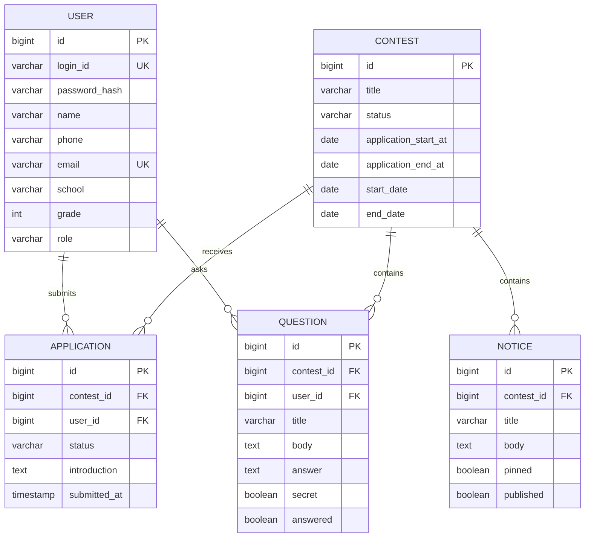

# Highschool SW Contest 기능 및 API 정리

## 1. 서비스 범위

이 서비스는 여러 대회를 운영하는 플랫폼이다. 사용자는 회원가입과 로그인을 한 뒤 각 대회에 참가 신청할 수 있고, 대회별 공지사항과 Q&A를 확인하거나 작성할 수 있다.

### 대회별 기능

- 공지사항: 운영자가 대회별 공지를 작성·수정·공개한다.
- Q&A: 로그인 사용자가 질문을 작성하고, 운영자가 답변·공개 상태를 관리한다.
- 참가 신청: 로그인 사용자가 대회별로 신청서를 작성·수정·취소한다.

### 공통 기능

- 회원가입
- 로그인·로그아웃·내 정보 조회
- 관리자와 일반 사용자 권한 구분

## 2. 회원 정보

| 필드 | 설명 | 필수 | 비고 |
| --- | --- | --- | --- |
| id | 사용자 식별자 | 자동 생성 | 내부 PK |
| loginId | 로그인 아이디 | 예 | 중복 불가 |
| passwordHash | 비밀번호 해시 | 예 | 평문 저장 금지 |
| name | 이름 | 예 |  |
| phone | 전화번호 | 예 |  |
| email | 이메일 | 예 | 중복 불가 권장 |
| school | 학교 | 예 |  |
| grade | 학년 | 예 | 1~3 |
| role | 권한 | 자동 생성 | `USER`, `ADMIN` |
| createdAt | 가입 일시 | 자동 생성 |  |

## 3. 핵심 데이터 모델

## 4. 권한 기준

| 기능 | 비로그인 | 회원 | 관리자 |
| --- | :---: | :---: | :---: |
| 대회·공지 조회 | 가능 | 가능 | 가능 |
| Q&A 공개 글 조회 | 가능 | 가능 | 가능 |
| 비밀 Q&A 조회 | 불가 | 작성자만 | 가능 |
| Q&A 질문 작성 | 불가 | 가능 | 가능 |
| 참가 신청 | 불가 | 가능 | 가능 |
| 대회·공지·Q&A 관리 | 불가 | 불가 | 가능 |

## 5. API 초안

### 인증

| Method | Path | 권한 | 설명 |
| --- | --- | --- | --- |
| POST | `/api/auth/signup` | Public | 회원가입 |
| POST | `/api/auth/login` | Public | 로그인 및 세션 발급 |
| POST | `/api/auth/logout` | Login | 로그아웃 |
| GET | `/api/auth/me` | Login | 현재 사용자 조회 |

### 공개 대회 화면

| Method | Path | 권한 | 설명 |
| --- | --- | --- | --- |
| GET | `/api/public/contests` | Public | 공개 대회 목록 |
| GET | `/api/public/contests/:contestId` | Public | 대회 상세 |
| GET | `/api/public/contests/:contestId/notices` | Public | 대회별 공지 목록 |
| GET | `/api/public/contests/:contestId/notices/:noticeId` | Public | 공지 상세 |
| GET | `/api/public/contests/:contestId/questions` | Public | 공개 Q&A 목록 |
| GET | `/api/public/contests/:contestId/questions/:questionId` | Public | Q&A 상세 |

### 회원 기능

| Method | Path | 권한 | 설명 |
| --- | --- | --- | --- |
| POST | `/api/contests/:contestId/questions` | Login | Q&A 질문 작성 |
| PATCH | `/api/contests/:contestId/questions/:questionId` | 작성자 | 내 질문 수정 |
| DELETE | `/api/contests/:contestId/questions/:questionId` | 작성자 | 내 질문 삭제 |
| POST | `/api/contests/:contestId/applications` | Login | 참가 신청 |
| GET | `/api/contests/:contestId/applications/me` | Login | 내 참가 신청 조회 |
| PATCH | `/api/contests/:contestId/applications/me` | 신청자 | 내 신청 수정 |
| DELETE | `/api/contests/:contestId/applications/me` | 신청자 | 참가 신청 취소 |

### 관리자 기능

| Method | Path | 권한 | 설명 |
| --- | --- | --- | --- |
| POST / PATCH / DELETE | `/api/admin/contests` | Admin | 대회 등록·수정·삭제 |
| POST / PATCH / DELETE | `/api/admin/contests/:contestId/notices` | Admin | 공지 관리 |
| GET | `/api/admin/contests/:contestId/questions` | Admin | 전체 Q&A 조회 |
| POST | `/api/admin/contests/:contestId/questions/:questionId/answer` | Admin | Q&A 답변 등록·수정 |
| PATCH | `/api/admin/contests/:contestId/applications/:applicationId/status` | Admin | 참가 신청 상태 변경 |

## 6. 구현 순서

1. `User`와 로그인·회원가입부터 구현한다.
2. `Contest`, `Notice`를 대회 ID 기준 구조로 정리한다.
3. `Question`과 답변 관리 기능을 구현한다.
4. `Application`과 신청 상태 관리 기능을 구현한다.
5. 프론트를 위 API 경로와 응답 형식에 맞춰 연결한다.

## 7. 결정이 필요한 항목

- 참가 신청은 개인 신청인지, 팀 신청까지 지원할지
- Q&A 비밀글을 운영자에게만 보이게 할지
- 신청서에 추가로 받을 항목(소개, 포트폴리오 URL, 첨부파일 등)
- 회원가입 시 이메일 인증 또는 아이디 중복 확인 API를 별도로 둘지
